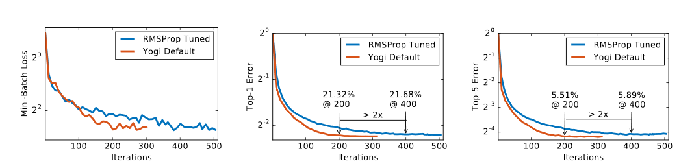
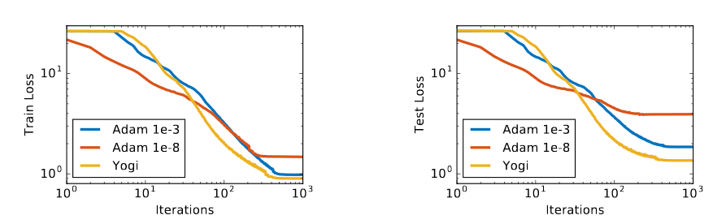
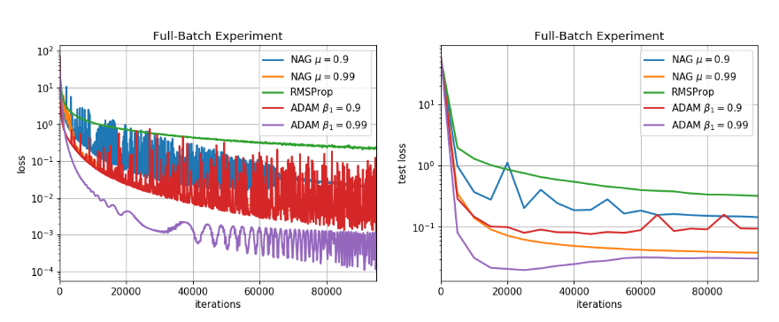
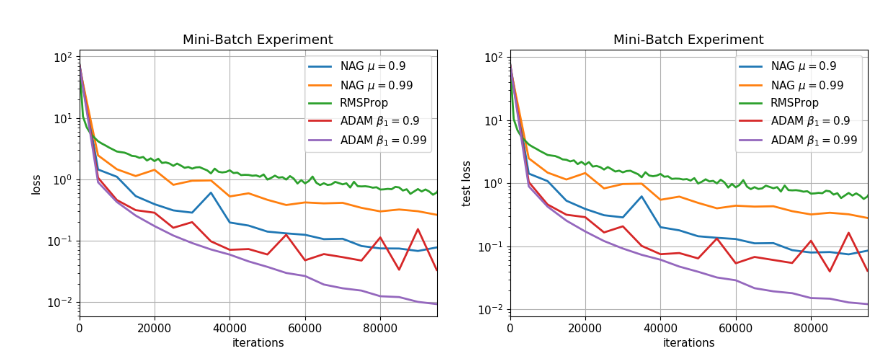
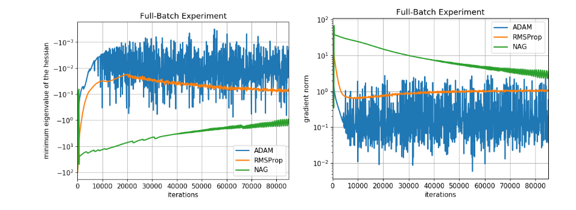
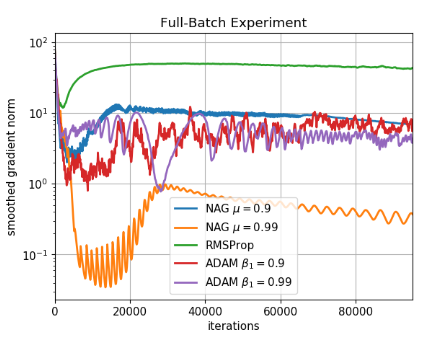
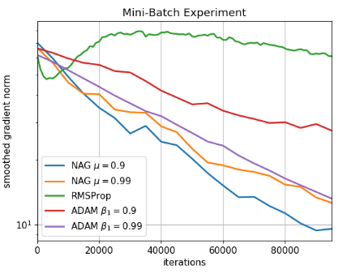

# Roadmap project - Optimization for Machine Learning

## Table of Contents

- [Roadmap project - Optimization for Machine Learning](#roadmap-project---optimization-for-machine-learning)
  - [Table of Contents](#table-of-contents)
  - [Preferences](#preferences)
    - [Choice](#choice)
  - [Goal](#goal)
    - [Hypothesis and goal](#hypothesis-and-goal)
    - [Optimizers](#optimizers)
    - [Objectives](#objectives)
    - [Comparisons, models](#comparisons-models)
  - [Similar papers](#similar-papers)
    - [Additional reading](#additional-reading)
  - [Schedule](#schedule)
    - [Week 1 - 1 May](#week-1---1-may)
    - [Week 2 - 8 May](#week-2---8-may)
    - [Week 3 - 15 May](#week-3---15-may)
    - [Week 4 - 22 May](#week-4---22-may)
    - [Week 5 - 29 May](#week-5---29-may)
    - [Week 6 - 5 June](#week-6---5-june)
    - [Week 7 - 12 June](#week-7---12-june)

---

## Preferences

- Lucien
  - ✔️ AdaGrad / Adam / signSGD: Can you suggest/try different data-dependent coordinate-wise learning rate schemes and compare them?
  - ❌ For training deep nets with very large SGD mini-batches: when does the scalability gain disappear? Is it influenced by other properties of the optimizer For example, what is the effect of first slowly growing the learning rate and then later decreasing it?
  - ❓ Frank-Wolfe or Coordinate-Descent for deep learning?
- Marijn
  - ✔️ AdaGrad / Adam / signSGD: Can you suggest/try different data-dependent coordinate-wise learning rate schemes and compare them?
  - ❌ How well do zero-order optimization methods do for ML applications, compared to standard first-order methods?
  - ❌ Asynchronous SGD: How do different delays affect convergence? How does it interplay with momentum? Does it act as a regularizer, like drop-out?
- Flo
  - ✔️ AdaGrad / Adam / signSGD: Can you suggest/try different data-dependent coordinate-wise learning rate schemes and compare them?
  - ❌ Along a training trajectory for a deep net, does the behaviour of each step resemble the convex case, is it different early or late in training?
  - ❓ Local minima for deep learning: Can you find differences between the 'shape' of local minima that SGD finds, depending on different step-sizes or mini-batch size, vs e.g. AdaGrad or full gradient descent?
  - ❌ Meta-Learning: Can you learn the learning rate? The direction or curvature? See also the larger field of AutoML.

### Choice

- ✔️ AdaGrad / Adam / signSGD: Can you suggest/try different data-dependent coordinate-wise learning rate schemes and compare them?
  - ✔️ Benchmarking
  - ❌ Introduce own algorithm
- ❌ Frank-Wolfe or Coordinate-Descent for deep learning?
- ❌ Local minima for deep learning: Can you find differences between the 'shape' of local minima that SGD finds, depending on different step-sizes or mini-batch size, vs e.g. AdaGrad or full gradient descent?
  - [Loss landscape of neural nets](https://papers.nips.cc/paper/7875-visualizing-the-loss-landscape-of-neural-nets.pdf)
  - [How global local minima work?](https://papers.nips.cc/paper/8524-asymmetric-valleys-beyond-sharp-and-flat-local-minima.pdf)

---

## Goal

- AdaGrad / Adam / signSGD: Can you suggest/try different data-dependent coordinate-wise learning rate schemes and compare them?
  - Benchmarking
  - RMSProp
- Non-convex  
- Autoencoder
- Compute loss during iterations (train and testing maybe):    
- Accuracy
- Test loss depending on number of parameters (double slope(?), maybe different shapes) -> regularization
- Gradient norm:   
- MNIST or CIFAR
- Compare different networks? Not so interesting...

### Hypothesis and goal

We'll see if when augmenting the number of parameters the optimizers can still train. Our hypothesis is that Adam is more stable than RMSProp and Sign-SGD. If time we'll see if we can implement Nadam and see if it's faster. Three networks with different number of parameters, see how they train. Train/test loss over number of epochs. Check stability with gradient norm.

### Optimizers

1. SGD, NAG
2. SignSGD
3. RMSProp
4. Adam
5. NAdam
  
How similar are the parameters? How do we choose which one we show? - query assistant

### Objectives

- With loss depending on #iteration, we have an idea of the fastest algo
- With gradient norm, we have an idea of the most stable algo
- With loss depending on #parameters, we have an idea of the best regularized algo

### Comparisons, models

- Auto-encoder (MNIST or CIFAR) and check different metrics
- Vary number of parameters of auto-encoder (for example repeat a layer many times, to have a deeper net)
- We won't have many different architectures, we want to compare algorithms not deep net structures

---

## Similar papers

- ICLR: [Convergence Guarantees for RMSProp and ADAM in Non-Convex Optimization and an Empirical Comparison to Nesterov Acceleration](https://openreview.net/forum?id=rkgd0iA9FQ)
- NIPS: [Adaptive Methods for Nonconvex Optimization](https://papers.nips.cc/paper/8186-adaptive-methods-for-nonconvex-optimization.pdf)
- ICLR: [On the Convergence of A Class of Adam-Type Algorithms for Non-Convex Optimization](https://arxiv.org/pdf/1808.02941.pdf)
- cs.LG: [signSGD: Compressed Optimisation for Non-Convex Problems](https://arxiv.org/pdf/1802.04434.pdf)
- CVPR: [A Sufficient Condition for Convergences of Adam and RMSProp](http://openaccess.thecvf.com/content_CVPR_2019/papers/Zou_A_Sufficient_Condition_for_Convergences_of_Adam_and_RMSProp_CVPR_2019_paper.pdf)
- MATEC: [An Optimization Strategy Based on Hybrid Algorithm of Adam and SGD](https://www.researchgate.net/publication/329039554_An_Optimization_Strategy_Based_on_Hybrid_Algorithm_of_Adam_and_SGD)
- [A Comparative Analysis of Gradient Descent-Based Optimization Algorithms on Convolutional Neural Networks](https://ieeexplore.ieee.org/document/8769211)

### Additional reading

- [An overview of gradient descent optimization algorithms](https://ruder.io/optimizing-gradient-descent/)

---

## Schedule

### Week 1 - 1 May

- Meeting
- Broadly define goal
- Talk with assistant for clearer objectives

### Week 2 - 8 May

- Find papers in litterature for insipration (What dataset? what methods?)
- Define project's overall goal precisely
- Find the major objectives we want to reach to achieve the project's goal
- Get in touch with the different optimizers

### Week 3 - 15 May

- Report's structure
- Start coding

### Week 4 - 22 May

- Clean code, final version

### Week 5 - 29 May

- Write report

### Week 6 - 5 June

- Write code
  - Auto-encoder
    - Why?
  - CIFAR
  - Steps:
    - Load CIFAR
    - Train
    - Modular for different optimizers
    - Plots
  - NAdam?

### Week 7 - 12 June
